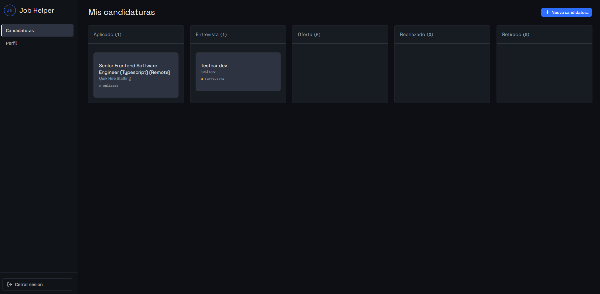
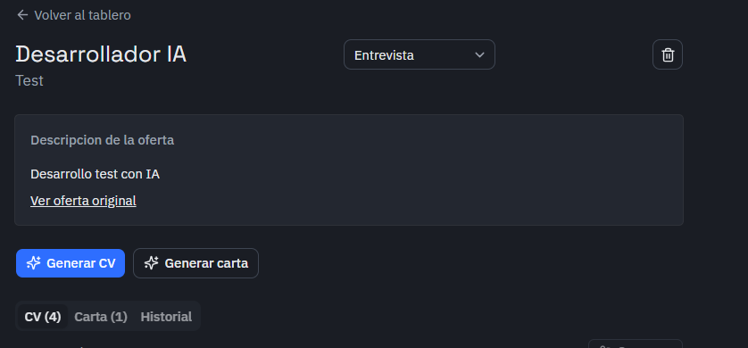
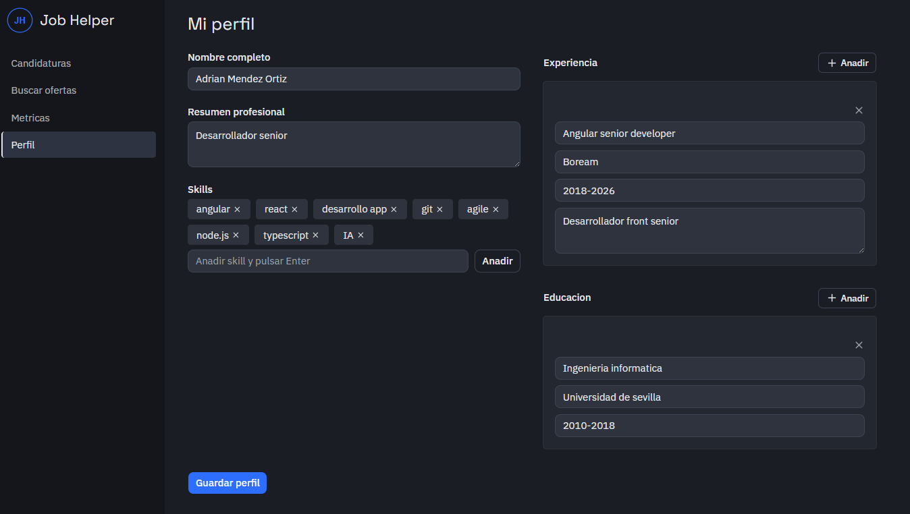

# Job Helper — Frontend

Aplicación web del asistente de búsqueda de empleo: tablero Kanban de candidaturas, generación de CV y carta de presentación adaptados con IA, dashboard de métricas del proceso, comparador de versiones y exportación a Word/PDF. Instalable como PWA (escritorio, móvil y Android nativo vía TWA).

**Demo en vivo:** [job-helper-adrianmnd.vercel.app](https://job-helper-adrianmnd.vercel.app)

## Capturas

| Tablero Kanban | Detalle de candidatura |
|---|---|
|  |  |

| Perfil |
|---|
|  |

## Stack

- **React 19** + TypeScript + Vite
- **Tailwind CSS v4** (CSS-first, sin `tailwind.config.js`) + **shadcn/ui** (sobre Base UI, no Radix)
- **React Router v6**
- **@dnd-kit** — arrastrar candidaturas entre columnas del Kanban
- **Recharts** — dashboard de métricas
- **diff** — comparador visual de versiones de CV
- **vite-plugin-pwa** — manifest + service worker, instalable en escritorio/móvil
- **Vitest** + Testing Library (tests unitarios) y **Playwright** (tests e2e contra servidores reales, con Gemini mockeado para evitar dependencias no deterministas)
- Tipografías: Space Grotesk (titulares), IBM Plex Sans (interfaz), IBM Plex Mono (datos puntuales)

## Identidad visual

Tema oscuro con un único acento de color (azul eléctrico), reservado exclusivamente para acciones principales y estados activos — el resto de la interfaz vive en una escala de grafito/gris. Los estados de cada candidatura (Aplicado, Entrevista, Oferta, Rechazado, Retirado) tienen su propio color categórico, consistente entre el Kanban, el detalle de la candidatura y el dashboard de métricas.

## Funcionalidades

- **Tablero Kanban** con columnas por estado, arrastrar y soltar para cambiar de fase, y grid fluido que adapta el número de columnas visibles al ancho de pantalla sin scroll horizontal.
- **Generación de CV y carta de presentación** adaptados a cada oferta con Gemini, con historial completo de versiones por candidatura.
- **Comparador de versiones de CV**: selecciona dos versiones y visualiza las diferencias resaltadas campo a campo (texto añadido/eliminado).
- **Exportación** de cualquier versión generada a Word (`.docx`) o PDF.
- **Buscador de ofertas**: busca ofertas reales (API de Adzuna) y crea una candidatura directamente desde un resultado con un clic. La búsqueda y sus resultados persisten en `sessionStorage`, sobreviviendo a recargas de página dentro de la misma pestaña.
- **Timeline de historial de estado** por candidatura.
- **Dashboard de métricas**: embudo de conversión (Aplicado → Entrevista → Oferta) y tiempo medio en cada fase.
- **Captura de ofertas desde imagen o PDF** (Gemini Vision) al crear una candidatura.
- **Perfil** con sugerencias de skills autocompletadas (con navegación completa por teclado).
- **PWA instalable**, con comportamiento de doble pulsación en "atrás" para salir cuando se ejecuta como app instalada (Android/escritorio).

## Setup local

```bash
npm install
cp .env.example .env
# Ajusta VITE_API_URL si tu backend no corre en localhost:3001

npm run dev
```

## Integrar shadcn/ui

El proyecto ya tiene Tailwind v4, el alias `@/` y `src/lib/utils.ts` (helper `cn`) preparados para la CLI de shadcn:

```bash
npx shadcn@latest add <componente>
```

Cada componente se copia como código fuente a `src/components/ui/` — no es una dependencia oculta, se puede leer y modificar como cualquier otro archivo del repo. Los componentes de shadcn en este proyecto están construidos sobre **Base UI** (no Radix): la API de composición usa la prop `render` en vez de `asChild` en triggers de Dialog/Select/Dropdown/Sheet.

## Estructura

```
src/
  pages/          Vistas de nivel de ruta: KanbanBoard, ApplicationDetail, Profile, Metrics, Login, Register
  components/     Componentes de dominio (ApplicationCard, CvDocument, CvDiff, StatusTimeline, Layout...)
  components/ui/  Componentes de shadcn/ui
  context/        AuthContext (JWT en localStorage)
  lib/            api.ts (cliente fetch), statuses.ts (fuente única de estados/colores), utils.ts
e2e/              Tests end-to-end con Playwright
```

## Tests

```bash
npm run test        # Unitarios (Vitest + Testing Library)
npm run test:e2e    # End-to-end (Playwright, levanta backend + frontend automáticamente)
```

Los tests e2e usan `E2E_MOCK_GEMINI=true` en el backend para sustituir las llamadas reales a Gemini por una respuesta fija — evita que la suite dependa de la disponibilidad de la API externa.

## Despliegue

Desplegado en **Vercel**. `vercel.json` incluye la reescritura necesaria para que las rutas de React Router funcionen al recargar o entrar directamente a una URL (`/profile`, `/applications/:id`, etc.), sirviendo siempre `index.html` para rutas no estáticas.

## Repositorios relacionados

- [job-helper-backend](https://github.com/AdrianMnd/job-helper-backend) — API (Node.js + Express + PostgreSQL)
- [job-helper-extension](https://github.com/AdrianMnd/job-helper-extension) — Extensión de navegador
- [job-helper-android](https://github.com/AdrianMnd/job-helper-android) — Versión Android (TWA)

## Licencia

ISC — ver [LICENSE](./LICENSE)
